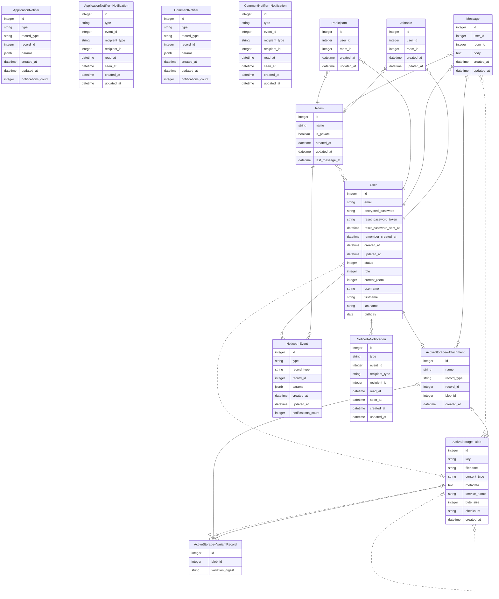

# Turbochat

## Demo
https://github.com/BinhNguyenDang/Demo-Turbochat/assets/146049423/b44c4a06-5c43-4b8b-ad67-e0be8f68b250

## Database



## Features

- Real-time Messaging: Utilizes Turbo and Stimulus to provide users with instant messaging capabilities, ensuring fast and responsive communication.
- Chatrooms and Direct Messaging: Users can engage in both group conversations through chatrooms and one-on-one conversations via direct messaging.
- Voice Record function.
- User Status: Displays user status indicators to show availability or activity, enhancing the overall messaging experience.
- ActiveStorage Integration: Implemented ActiveStorage for user avatar and attachment capabilities, allowing users to personalize their profiles and share files seamlessly.
- Search and Joinable Rooms: Users can easily search for and join existing chatrooms, facilitating community engagement and collaboration.
- Admin Functionality: Admin users have the ability to create chatrooms, manage user permissions, and moderate conversations as needed, ensuring a safe and organized messaging environment.
- In chat command function.
- Admin Dashboard with graphing of daily messages.
- User basic info page and recent activities displayed. 
  

## Prerequisites

Before getting started, ensure that you have the following installed:

- Ruby (version 3.3.0)
- Rails (version 7.1.3 or higher)
- PostgreSQL (with appropriate configurations)
- Yarn

## Installation

1. Clone this repository to your local machine:
```yaml
git clone <repository-url>
```
2. Navigate into the project directory:
```yaml
cd Demo-Turbochat
```
3. Install the required Ruby gems:
```yaml
bundle install
```
4. Install JavaScript dependencies:
```yaml
yarn install
```
5. Remove the existing credentials file if it exists:
```yaml
rm config/credentials.yml.enc
```
6. Run the following command in your terminal to create a new encrypted credentials file:
```yaml
rails credentials:edit
```
This will open the credentials file in your default editor.

 Open the encrypted credentials file by running the following command in your terminal:

   ```bash
   EDITOR="code --wait" rails credentials:edit
```
7. Update the `DB_NAME`, `DB_USERNAME`, and `DB_PASSWORD` values for the development, test, and production environments in the credentials file with this structure.

## Database Credentials

```yaml
DB_NAME:
  dev_db: turbo_dev1
  test_db: turbo_test1
  prod_db: turbo_prod1
DB_USERNAME:
  dev_db: turbo_dev1
  test_db: turbo_test1
  prod_db: turbo_prod1
DB_PASSWORD:
  dev_db: password123
  test_db: password1234
  prod_db: password12345
```
Once you've updated the database credentials, configured the database connection, and created the necessary databases, you're ready to run the application. Start by launching the Rails console:
```yaml
rails console
```
Then, launch the PostgreSQL command line interface:
```yaml
psql
```
Within the PostgreSQL command line interface, create the required databases for turbo_dev1 and turbo_test1 (depending on your credentials edit):
```yaml
CREATE user turbo_dev1 WITH PASSWORD 'password123';
CREATE user turbo_test1 WITH PASSWORD 'password123';
ALTER turbo_dev1 WITH CREATEDB;
ALTER turbo_test1 WITH CREATEDB;
```
After creating the databases, you can exit the PostgreSQL command line interface:
```yaml
\q
```
Before starting the application, ensure that you have created the databases for development and testing environments. Run the following commands in your terminal:
```yaml
rails db:create
```
Then: 
```yaml
rails db:migrate
```

## Running the Application

To start the Rails server, run the following command:
```yaml
rails s
```
- The application will be accessible at `http://localhost:3000`.
- Database Preview will be acessible at `http://localhost:3000/erd/index.html`

## App Image


